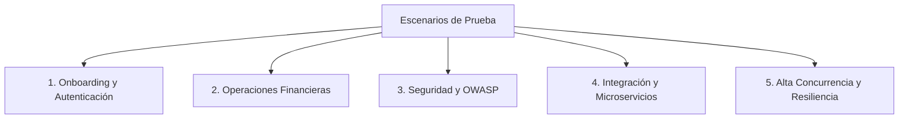

# Catálogo de Escenarios de Prueba de Producción - Proyecto Zappi

Este catálogo define todos los escenarios de prueba requeridos para certificar y validar la calidad, seguridad, tolerancia a fallos y rendimiento del sistema de Billetera Digital **Zappi** en un entorno de **Producción**.

---

## 🧭 Estructura del Catálogo de Pruebas

Los escenarios están organizados en 5 categorías fundamentales:

---

## 1. Escenarios de Onboarding y Autenticación

### EP-ONB-001: Flujo Completo Happy Path de Onboarding
* **Objetivo**: Validar el registro de un cliente nuevo desde la identificación del dispositivo hasta la creación final de la cuenta.
* **Flujo**:
  1. `/v1/device-identify` -> Registra terminal y obtiene `X-Device-Token`.
  2. `/v1/document-extensions` -> Obtiene catálogo de extensiones.
  3. `/v1/users-validate` -> Valida identidad y pre-registra usuario.
  4. `/v1/otp-generate` -> Simula generación y envía OTP; se valida el código.
  5. `/v1/face-recognition-init` -> Inicializa biometría, obtiene `session_id`.
  6. `/v1/face-recognition-valid` -> Envía selfie válida y aprueba biometría.
  7. `/v1/reference/register` -> Registra código de referido (opcional).
  8. `/v1/users-create` -> Genera PIN y cuenta en Cognito.
* **Criterio de Aceptación**: Cuenta creada exitosamente con estado activo en Cognito, billetera asociada creada en `wallet_db` con balance inicial de 0.00.

### EP-ONB-002: Reintento de Onboarding con Usuario Preexistente
* **Objetivo**: Validar que el sistema impida duplicados de documentos de identidad o número celular.
* **Pasos**:
  1. Invocar `/v1/users-validate` usando un número de documento y celular de un usuario ya activo.
* **Resultado Esperado**: Retorna HTTP 200 con `is_client: true` e indica que el flujo de registro ya fue completado, redirigiendo a login.

### EP-ONB-003: Expiración del Código OTP
* **Objetivo**: Validar que los códigos de un solo uso expiren después del tiempo límite (ej. 3 minutos).
* **Pasos**:
  1. Iniciar `/v1/users-validate`.
  2. Generar código OTP.
  3. Esperar 4 minutos.
  4. Intentar validar el código llamando a `/v1/otp-generate`.
* **Resultado Esperado**: Código HTTP 400 Bad Request, `state` = 1, mensaje "OTP expilado o inválido".

### EP-ONB-004: Rechazo de Biometría Facial
* **Objetivo**: Validar el comportamiento ante fotos que no cumplen con los requisitos de Rekognition (baja resolución o falta de correspondencia).
* **Pasos**:
  1. Iniciar sesión facial con `/v1/face-recognition-init`.
  2. Enviar en `/v1/face-recognition-valid` una selfie borrosa o de otra persona.
* **Resultado Esperado**: Código HTTP 400, transacción fallida y recomendación al usuario de repetir la foto.

---

## 2. Escenarios de Operaciones Financieras

### EP-FIN-001: Autenticación (Sign-In) y Consulta de Saldos
* **Objetivo**: Validar el login y la obtención de saldos.
* **Pasos**:
  1. Ejecutar `/v1/sign-in` con celular y PIN válidos. Obtener el `private_token` (JWT).
  2. Invocar `/v1/balances` enviando el JWT en la cabecera `Authorization: Bearer`.
* **Resultado Esperado**: Retorna HTTP 200 con las tarjetas virtuales habilitadas, saldo actual exacto y catálogo de últimos movimientos.

### EP-FIN-002: Transferencia Segura entre Cuentas (Happy Path)
* **Objetivo**: Validar la transferencia de saldo de forma íntegra.
* **Pasos**:
  1. Validar cuenta destino llamando a `/v1/transfers/users-validate` (debe existir).
  2. Generar token transaccional de un solo uso llamando a `/v1/token-generate`.
  3. Ejecutar `/v1/transfers-execute` enviando saldo suficiente, cuenta origen, PIN de firma y el token transaccional obtenido.
* **Resultado Esperado**: HTTP 200, código de confirmación. El saldo de origen se descuenta de forma exacta y el de destino se incrementa de forma inmediata en `wallet_db`.

### EP-FIN-003: Rechazo de Transferencia por Saldo Insuficiente
* **Objetivo**: Validar que no se puedan realizar operaciones sobregiradas.
* **Pasos**:
  1. El cliente A tiene un saldo de 50.00 BOL.
  2. Intenta transferir 100.00 BOL al cliente B invocando `/v1/transfers-execute`.
* **Resultado Esperado**: Código HTTP 400 con `state` = -2 (Validación de negocio fallida) y mensaje de saldo insuficiente. No se altera ninguna cuenta.

### EP-FIN-004: Recarga Telefónica Exitosa
* **Objetivo**: Validar el débito y la ejecución de recargas de celular para operadores.
* **Pasos**:
  1. Invocar `/v1/recharge-entel` con un monto válido (ej. 10.00 BOL).
* **Resultado Esperado**: Retorna HTTP 200 con código de transacción contable, descuenta 10.00 del saldo de la billetera y escribe la acción en el historial.

---

## 3. Escenarios de Seguridad y OWASP

### EP-SEC-001: Bloqueo de Fuerza Bruta en Autenticación (OWASP API4)
* **Objetivo**: Evitar ataques automatizados para adivinar el PIN de un usuario.
* **Pasos**:
  1. Enviar 5 peticiones consecutivas a `/v1/sign-in` con PIN incorrecto para el mismo celular.
* **Resultado Esperado**: La sexta petición es bloqueada inmediatamente con HTTP 429 Too Many Requests. La cuenta queda suspendida temporalmente por 15 minutos en Cognito.

### EP-SEC-002: Intento de Suplantación de Recursos (BOLA / IDOR - OWASP API1)
* **Objetivo**: Validar que un usuario logueado no pueda consultar información de otra persona.
* **Pasos**:
  1. El Usuario A inicia sesión y obtiene su JWT.
  2. El Usuario A invoca `/v1/movements` enviando en el body el número de cuenta de la víctima B, pero utilizando el JWT del Usuario A en la cabecera `Authorization`.
* **Resultado Esperado**: HTTP 403 Forbidden. El servidor detecta la discrepancia entre el dueño de la cuenta y el ID contenido en el token, rechazando la petición.

### EP-SEC-003: Inyección de SQL en Validación de Identidad (OWASP API3)
* **Objetivo**: Validar la resistencia ante ataques de inyección de código SQL.
* **Pasos**:
  1. Enviar en la petición `/v1/users-validate` un campo `document_number` con caracteres especiales de inyección: `' OR '1'='1`.
* **Resultado Esperado**: HTTP 400 Bad Request. Las librerías de validación de esquemas rechazan la entrada por caracteres no válidos antes de interactuar con PostgreSQL.

---

## 4. Escenarios de Integración y Microservicios

### EP-INT-001: Validación de Consistencia de Datos en Split de DBs
* **Objetivo**: Validar que la segregación de datos funcione correctamente sin dependencias directas en base de datos.
* **Pasos**:
  1. Registrar un dispositivo en `device_db`.
  2. Modificar el nombre del usuario en `customer_db`.
  3. Ejecutar una consulta de saldo en `wallet_db`.
* **Resultado Esperado**: Cada base de datos responde independientemente. `wallet_db` no se bloquea si `device_db` sufre latencia.

### EP-INT-002: Fallo de Comunicación Inter-Servicio (Tolerancia a Fallos)
* **Objetivo**: Validar el comportamiento del sistema cuando un microservicio de dependencia no responde.
* **Pasos**:
  1. Apagar temporalmente el microservicio *Customer Service*.
  2. Intentar realizar una transferencia `/v1/transfers-execute` desde el *Wallet Service* (el cual necesita validar al usuario destino contra el *Customer Service*).
* **Resultado Esperado**: El *Wallet Service* ejecuta los reintentos automáticos (3 veces). Si persiste la desconexión, falla con un error controlado HTTP 504 Gateway Timeout y revierte la transacción para no dejar saldos huérfanos.

---

## 5. Escenarios de Alta Concurrencia y Resiliencia (10k Conexiones)

### EP-PER-001: Prueba de Carga de 10,000 Peticiones Simultáneas (Rendimiento)
* **Objetivo**: Medir la capacidad de respuesta de la API bajo picos de carga extremos en producción.
* **Metodología**:
  * Utilizar una herramienta de pruebas de carga distribuida (ej. k6 o Artillery) desde múltiples IPs externas.
  * Ejecutar 10,000 conexiones concurrentes sostenidas durante 10 minutos simulando el flujo de `/v1/balances` y `/v1/movements`.
* **Criterio de Aceptación**:
  * El 99% de las peticiones (P99) deben responder en menos de **200 milisegundos**.
  * El porcentaje de error de conexión debe ser inferior al **0.1%**.
  * RDS Proxy y Redis deben registrar un uso eficiente de conexiones sin saturación.

### EP-PER-002: Escalado Automático de Contenedores (Resiliencia)
* **Objetivo**: Validar que ECS Fargate autoscale los contenedores horizontalmente bajo picos repentinos de tráfico.
* **Pasos**:
  1. Lanzar una carga simulada incrementando rápidamente de 1,000 a 10,000 peticiones simultáneas.
  2. Monitorear el despliegue de nuevos ECS Tasks.
* **Resultado Esperado**: Al superar el 60% de uso de CPU/Memoria en los contenedores activos, ECS Fargate aprovisiona nuevas tareas concurrentes en menos de 90 segundos para equilibrar la carga.

### EP-PER-003: Failover de Base de Datos con RDS Multi-AZ
* **Objetivo**: Validar la continuidad del negocio si ocurre un fallo en la base de datos primaria en producción.
* **Pasos**:
  1. Mantener una carga de 1,000 transacciones simultáneas de consulta de saldo.
  2. Forzar un reinicio con failover manual de la base de datos primaria en AWS RDS.
* **Resultado Esperado**: RDS Proxy detecta el fallo y conmuta automáticamente el tráfico de lectura/escritura hacia la instancia de réplica de lectura (Multi-AZ) en menos de 15 segundos. Los clientes experimentan un breve retraso en la petición, pero no caídas de conexión.
