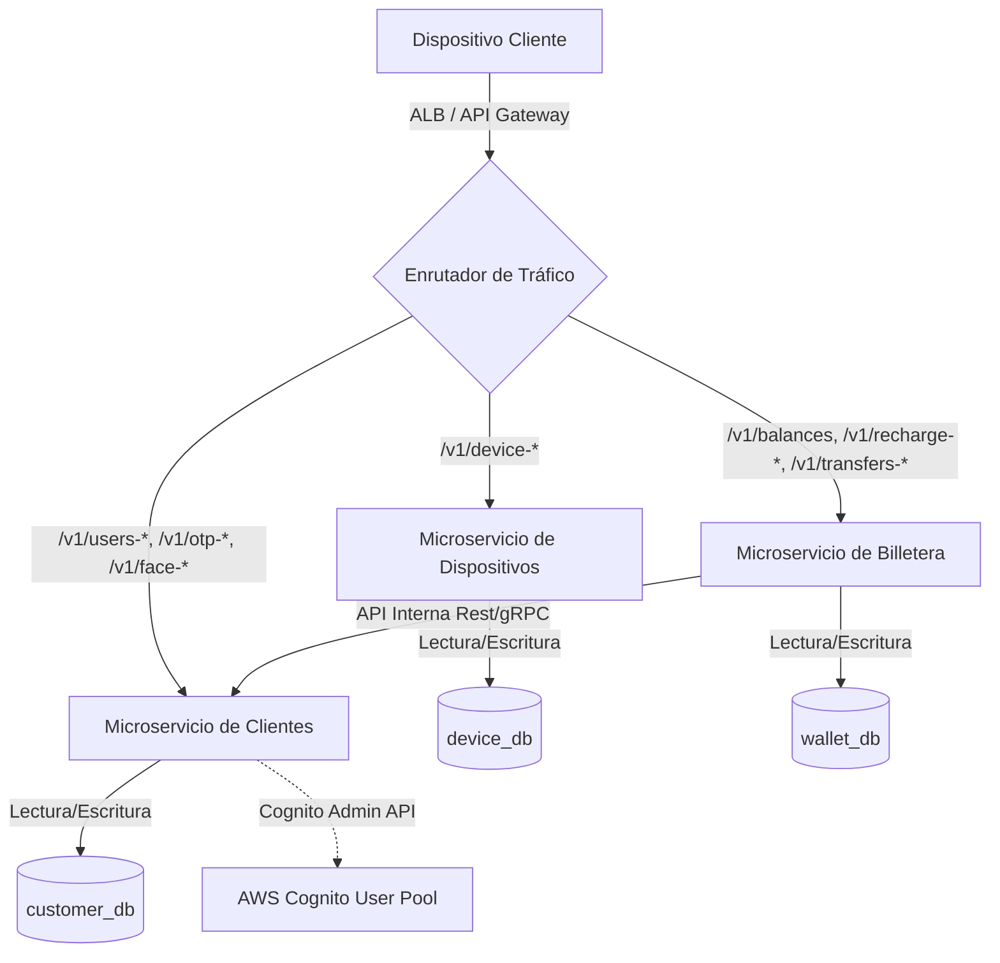
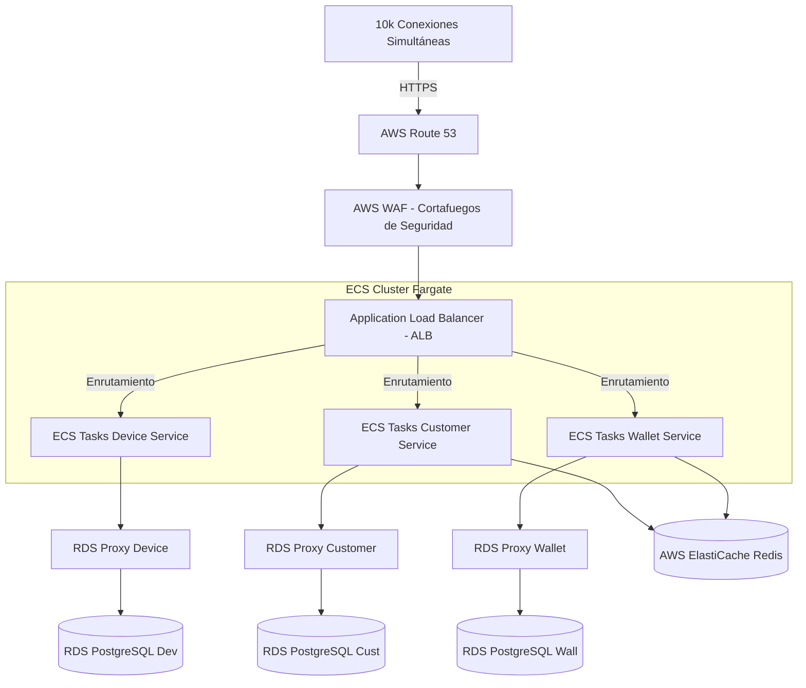

# Informe de Arquitectura y Diseño Técnico - Proyecto Zappi

Este informe describe los pilares de la modernización de la plataforma **Zappi Billetera Digital** para soportar un volumen de producción masivo (10,000+ conexiones simultáneas), estructurado bajo los principios de Clean Architecture, seguridad OWASP, y una arquitectura desacoplada de microservicios con bases de datos independientes.

---

## 🏗️ 1. Arquitectura de Microservicios y Bases de Datos Descentralizadas

Para garantizar alta escalabilidad, tolerancia a fallos y despliegues independientes, migramos el backend monolítico actual a una arquitectura de **tres microservicios dedicados**, donde cada uno controla estrictamente su propio almacenamiento de datos para evitar el antipatrón de base de datos compartida (*Shared Database*).



### Detalle de Microservicios y su Persistencia

#### A. Microservicio de Dispositivos y Seguridad (Device Service)
* **Responsabilidad**: Registrar la identidad de los terminales móviles, autorizar el hardware del cliente y administrar las claves de cifrado temporales de comunicación.
* **Endpoints**: `/v1/device-identify`, `/v1/device-auth`.
* **Base de Datos (`device_db`)**:
  * Tabla `devices`: Almacena `device_id` (PK), `device_type`, `encrypted_device` y metadatos de auditoría del dispositivo.

#### B. Microservicio de Clientes y Onboarding (Customer Service)
* **Responsabilidad**: Gestionar el registro de usuarios (onboarding), la validación de identidad (KYC), el OTP telefónico, la validación biométrica facial, y la autenticación final mediante Cognito.
* **Endpoints**: `/v1/document-extensions`, `/v1/users-validate`, `/v1/otp-generate`, `/v1/face-recognition-init`, `/v1/face-recognition-valid`, `/v1/reference/register`, `/v1/users-create`, `/v1/sign-in`, `/v1/parameters`.
* **Base de Datos (`customer_db`)**:
  * Tabla `users`: Información del perfil (documento, correo, celular, dirección, estado civil, sub de Cognito).
  * Tabla `otp_sessions`: Sesiones OTP de validación de número celular.
  * Tabla `face_sessions`: Sesiones biométricas asociadas al onboarding facial.
  * Tabla `reference_codes`: Registro de códigos de referidos ingresados.

#### C. Microservicio Transaccional y Wallet (Wallet Service)
* **Responsabilidad**: Administrar las cuentas financieras (billeteras), procesar recargas telefónicas, transferencias de saldo entre usuarios, tokens dinámicos de transferencia y el libro mayor (ledger) de movimientos.
* **Endpoints**: `/v1/balances`, `/v1/recharge-params`, `/v1/recharge-*`, `/v1/transfers/users-validate`, `/v1/token-generate`, `/v1/transfers-execute`, `/v1/movements`.
* **Base de Datos (`wallet_db`)**:
  * Tabla `wallet_accounts`: Cuenta de billetera (número de cuenta, saldo actual, moneda, estado).
  * Tabla `wallet_transactions`: Historial contable (cuenta origen/destino, monto, descripción, estado).
  * *Nota de Aislamiento*: Este servicio no tiene acceso directo a la tabla de usuarios. Para validar que un número de celular destino de una transferencia pertenece a un cliente válido, realiza una llamada interna HTTPS/gRPC al *Customer Service*.

---

## 🛡️ 2. Seguridad en APIs: Cabeceras JWT y Cumplimiento OWASP

### Configuración de JWT en las Cabeceras HTTP
Siguiendo las mejores prácticas de la industria, eliminamos los campos de tokens del cuerpo JSON de las peticiones para enviarlos en cabeceras HTTP nativas:

1. **Cabecera `X-Device-Token`**:
   * **Descripción**: Contiene el JWT del dispositivo generado tras `/v1/device-identify`. Identifica de forma única y segura al hardware que realiza la petición.
   * **Uso**: Requerido en todos los endpoints de onboarding pre-autenticados.
2. **Cabecera `Authorization`**:
   * **Formato**: `Bearer <JWT_SESION>`
   * **Descripción**: Contiene el token de sesión (Cognito ID/Access Token) emitido tras `/v1/sign-in`.
   * **Uso**: Requerido en todos los endpoints post-autenticación (balances, movimientos, transferencias, recargas).

---

### Mitigación de Vulnerabilidades OWASP Top 10 API Security

#### 1. API1:2023 - Autorización a Nivel de Objeto Rota (BOLA / IDOR)
* **Riesgo**: Que un usuario consulte el saldo o movimientos de otro cambiando el número de cuenta en el request body.
* **Mitigación**: Los microservicios no confiarán en los identificadores provistos en el request JSON. El middleware de autorización decodificará el JWT de la cabecera `Authorization`, extraerá el `user_id` o `cognito_sub` verificado, y el repositorio de base de datos consultará los recursos verificando que pertenezcan estrictamente a ese identificador de usuario.

#### 2. API2:2023 - Autenticación Rota
* **Riesgo**: Falsificación de firmas JWT o aceptación de tokens expirados.
* **Mitigación**: Implementación de un validador estricto de JWT utilizando las llaves públicas de Cognito (JWKS) almacenadas en memoria caché. Se rechazarán firmas con algoritmos débiles (por ejemplo, `alg: none`) y se verificará de manera mandatoria la expiración (`exp`), el emisor (`iss`), y la audiencia (`aud`).

#### 3. API3:2023 - Exposición Excesiva de Datos (BOLA)
* **Riesgo**: Retornar registros completos de la base de datos que contengan hashes de PINs o tokens de recuperación.
* **Mitigación**: Implementación de objetos de transferencia de datos (DTOs) estrictos en la capa de adaptadores (Clean Architecture) para mapear únicamente los campos requeridos por la interfaz del cliente según el PDF (ej. ocultar hashes de pin, claves de auditoría, etc.).

#### 4. API4:2023 - Consumo Desmedido de Recursos (Rate Limiting)
* **Riesgo**: Ataques de denegación de servicio (DoS) inundando la API de login o transferencias.
* **Mitigación**: Configuración de reglas de Rate Limiting en el API Gateway y a nivel de aplicación (usando Redis Token Bucket). Límites configurados: máximo 100 peticiones/minuto por IP para endpoints generales, y 5 peticiones/minuto para login y generación de OTP.

#### 5. Inyecciones de SQL (OWASP A03:2021)
* **Riesgo**: Inyección de código malicioso a través de campos de entrada como celular, número de documento o código de referido.
* **Mitigación**: Uso exclusivo de consultas parametrizadas (Prepared Statements) en la capa de datos. Implementación de librerías de validación de esquemas (ej. `Zod` o `Joi`) en la entrada de todos los controladores para rechazar cualquier carácter no conforme antes de tocar la lógica del negocio.

---

## 🎯 3. Diseño e Implementación de Clean Architecture

Cada microservicio se estructurará siguiendo los principios de separación de responsabilidades para aislar las reglas de negocio de los detalles tecnológicos (bases de datos, controladores, librerías de red):

```text
/src/
  ├── domain/                     # CAPA DOMINIO (Reglas de Negocio Puras)
  │   ├── entities/               # Entidades de negocio (ej. WalletAccount, Device)
  │   └── repositories/           # Interfaces/Contratos de acceso a datos
  │
  ├── use-cases/                  # CAPA CASOS DE USO (Orquestación de Procesos)
  │   ├── TransferMoney.ts        # Flujo de negocio de realizar una transferencia
  │   └── ValidateOtp.ts          # Flujo de validación de OTP
  │
  ├── adapters/                   # CAPA ADAPTADORES (Interfaces de Conexión)
  │   ├── controllers/            # Controladores HTTP (mapean JSON a Use Cases)
  │   ├── presenters/             # Formateadores de salida para la vista
  │   └── repositories/           # Implementación real de BD (SQL/PostgreSQL)
  │
  └── infrastructure/             # CAPA INFRAESTRUCTURA (Herramientas y Frameworks)
      ├── express/                # Servidor Express.js, rutas y middlewares
      ├── database/               # Pools de conexiones a la base de datos
      └── external-services/      # Integraciones con AWS Cognito, AWS Rekognition
```

* **Flujo de Dependencia**: Las dependencias van de afuera hacia adentro. La capa `domain` es totalmente pura y no importa nada de Express, Postgres, ni AWS SDK. Esto facilita realizar pruebas unitarias rápidas e independientes de la infraestructura.

---

## ⚡ 4. Optimización de Infraestructura para 10,000 Conexiones Simultáneas

Para atender un volumen masivo de 10,000 conexiones concurrentes y asegurar una latencia de respuesta ultra-baja (<150ms), se optimiza el diseño de infraestructura física mediante la siguiente arquitectura en AWS:



### Componentes Críticos de Escalabilidad

1. **ECS Fargate (Container Orchestration) en lugar de AWS Lambda**:
   * **Por qué**: Evita la latencia del inicio en frío (Cold Start) de Lambda en picos de tráfico de 10,000 conexiones, además de reducir el costo de procesamiento continuo y facilitar el uso de conexiones TCP persistentes.
   * **Configuración**: Auto Scaling Group basado en métricas de porcentaje de uso de CPU y Memory (>60%) y número de conexiones concurrentes por contenedor.
2. **AWS RDS Proxy (Connection Pooling)**:
   * **Por qué**: PostgreSQL reserva memoria por cada conexión del cliente (un servidor tradicional colapsa con más de 500 conexiones directas). RDS Proxy consolida y comparte un pool de conexiones establecidas hacia la base de datos, soportando miles de transacciones concurrentes desde los contenedores sin degradación de la BD.
3. **AWS ElastiCache Redis (Capa de Caché y Sesiones)**:
   * **Por qué**: Evita llamadas recurrentes a la base de datos para datos temporales.
   * **Uso**: Almacenamiento de tokens dinámicos transaccionales, estado de sesiones biométricas faciales (expiran en 5 minutos), y almacenamiento en caché de catálogos estáticos de extensiones.
4. **AWS WAF (Shield Protection)**:
   * Protege los balanceadores de carga contra ataques de inundación HTTP, inyecciones de SQL masivas y escaneos automáticos de bots vulnerables.
