# Documentación Técnica de Arquitectura y Diseño - Proyecto Zappi / AWS Backend

Este documento proporciona una visión profunda y técnica de la arquitectura, diseño y herramientas utilizadas en la implementación del backend de **Zappi**. El sistema está diseñado siguiendo principios de **Clean Architecture**, escalabilidad en la nube (Serverless) e Infraestructura como Código (IaC).

---

## 1. Visión General de la Arquitectura (Alto Nivel)

El sistema opera bajo un modelo **Serverless** alojado en Amazon Web Services (AWS). Se ha optado por una arquitectura orientada a eventos e integraciones nativas para minimizar el overhead operativo y maximizar la escalabilidad y seguridad.

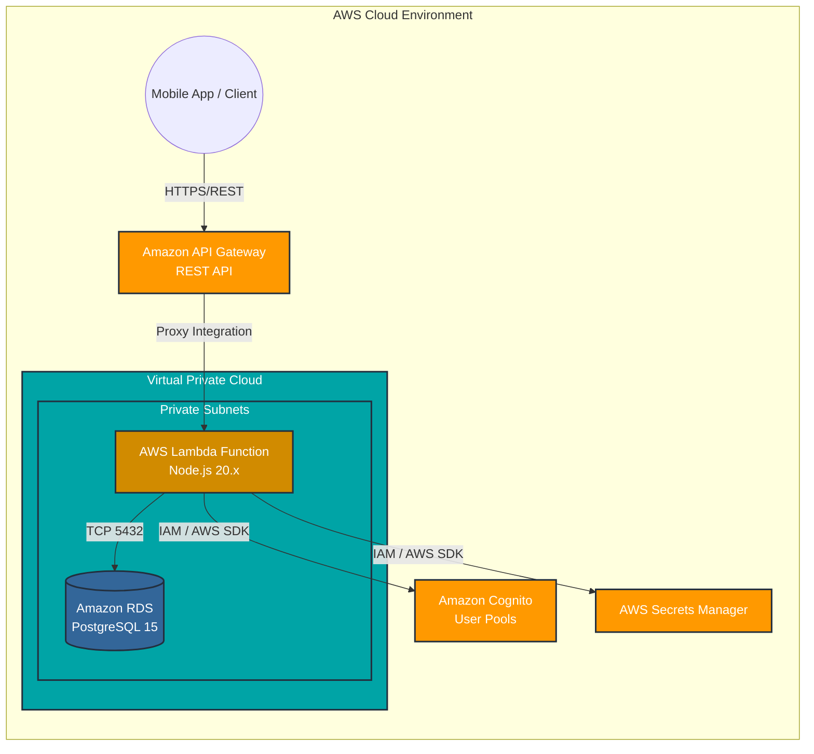
```mermaid
graph TD
    Client((Mobile App / Client))
    
    subgraph AWS Cloud [AWS Cloud Environment]
        direction TB
        APIGW[Amazon API Gateway<br/>REST API]
        Cognito[Amazon Cognito<br/>User Pools]
        SecretsManager[AWS Secrets Manager]
        
        subgraph VPC [Virtual Private Cloud]
            subgraph PrivateSubnet [Private Subnets]
                Lambda[AWS Lambda Function<br/>Node.js 20.x]
                RDS[(Amazon RDS<br/>PostgreSQL 15)]
            end
        end
        
        Client -- HTTPS/REST --> APIGW
        APIGW -- Proxy Integration --> Lambda
        Lambda -- IAM / AWS SDK --> Cognito
        Lambda -- TCP 5432 --> RDS
        Lambda -- IAM / AWS SDK --> SecretsManager
    end

    classDef aws fill:#FF9900,stroke:#232F3E,stroke-width:2px,color:white;
    classDef compute fill:#D18B00,stroke:#232F3E,stroke-width:2px,color:white;
    classDef db fill:#336699,stroke:#232F3E,stroke-width:2px,color:white;
    classDef network fill:#00A4A6,stroke:#232F3E,stroke-width:2px,color:white;
    
    class APIGW,Cognito,SecretsManager aws;
    class Lambda compute;
    class RDS db;
    class VPC,PrivateSubnet network;
```

### Decisiones Arquitectónicas Clave:
1. **API Gateway + Lambda:** Permite un escalado elástico y pago por uso, absorbiendo picos de tráfico sin comprometer el rendimiento.
2. **Aislamiento en VPC:** Las funciones Lambda y la base de datos RDS se despliegan en subredes privadas. La base de datos no tiene salida ni entrada directa a internet.
3. **Delegación de Identidad:** AWS Cognito actúa como el IdP (Identity Provider), manejando de forma segura políticas de contraseñas, SRP y flujos de autenticación.

---

## 2. Stack Tecnológico y Herramientas

El proyecto hace uso intensivo del ecosistema AWS y el ecosistema moderno de TypeScript, garantizando tipado estático, compilación rápida y despliegues predecibles.

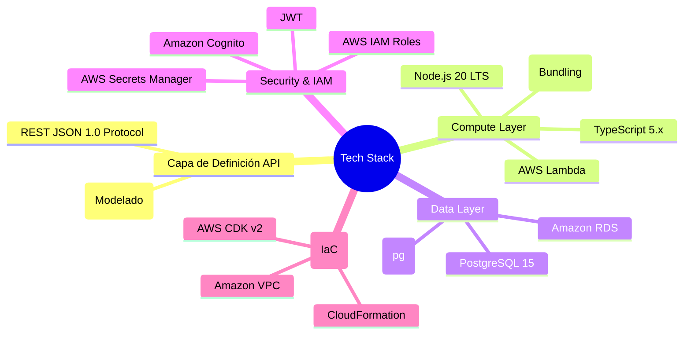
```mermaid
mindmap
  root((Tech Stack))
    Capa de Definición API
      AWS Smithy (Modelado)
      REST JSON 1.0 Protocol
    Compute Layer
      AWS Lambda
      Node.js 20 LTS
      TypeScript 5.x
      Esbuild (Bundling)
    Data Layer
      Amazon RDS
      PostgreSQL 15
      node-postgres (pg)
    Security & IAM
      Amazon Cognito
      AWS Secrets Manager
      AWS IAM Roles
      JWT
    Infraestructura (IaC)
      AWS CDK v2
      CloudFormation
      Amazon VPC
```

---

## 3. Arquitectura de Componentes e Infraestructura (CDK)

La infraestructura está modelada usando **AWS Cloud Development Kit (CDK)**. Se sigue un patrón de diseño estructural mediante la segregación en *Stacks* cohesivos, reduciendo el radio de impacto en los despliegues.

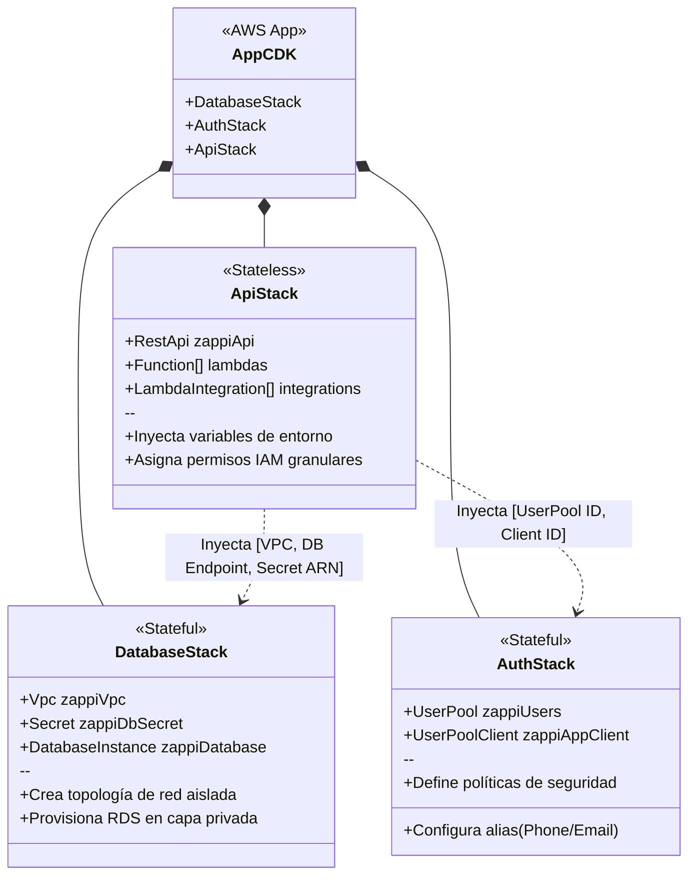
```mermaid
classDiagram
    class AppCDK {
        <<AWS App>>
        +DatabaseStack
        +AuthStack
        +ApiStack
    }
    
    class DatabaseStack {
        <<Stateful>>
        +Vpc zappiVpc
        +Secret zappiDbSecret
        +DatabaseInstance zappiDatabase
        --
        +Crea topología de red aislada
        +Provisiona RDS en capa privada
    }
    
    class AuthStack {
        <<Stateful>>
        +UserPool zappiUsers
        +UserPoolClient zappiAppClient
        --
        +Configura alias (Phone/Email)
        +Define políticas de seguridad
    }
    
    class ApiStack {
        <<Stateless>>
        +RestApi zappiApi
        +Function[] lambdas
        +LambdaIntegration[] integrations
        --
        +Inyecta variables de entorno
        +Asigna permisos IAM granulares
    }
    
    AppCDK *-- DatabaseStack
    AppCDK *-- AuthStack
    AppCDK *-- ApiStack
    
    ApiStack ..> DatabaseStack : Inyecta [VPC, DB Endpoint, Secret ARN]
    ApiStack ..> AuthStack : Inyecta [UserPool ID, Client ID]
```

### Capas del Backend (Código Fuente):
El código de los Lambdas en `backend/src` sigue una estructura limpia:
* `handlers/`: Punto de entrada de los lambdas. Orquestación lógica.
* `layers/database/`: Abstracción de conexión a base de datos (Pooler singleton).
* `layers/cognito/`: Interfaz con el SDK v3 de AWS Cognito.
* `utils/`: Respuestas HTTP estandarizadas y utilidades transversales.

---

## 4. Diagramas de Secuencia (Flujos Críticos)

A continuación, se detallan los flujos más complejos a nivel transaccional, demostrando la coordinación entre múltiples servicios.

### 4.1. Flujo de Creación de Cuenta (Sincronización Dual)
Este es un proceso crítico que requiere consistencia eventual entre el proveedor de identidad (Cognito) y nuestra base de datos relacional (RDS).

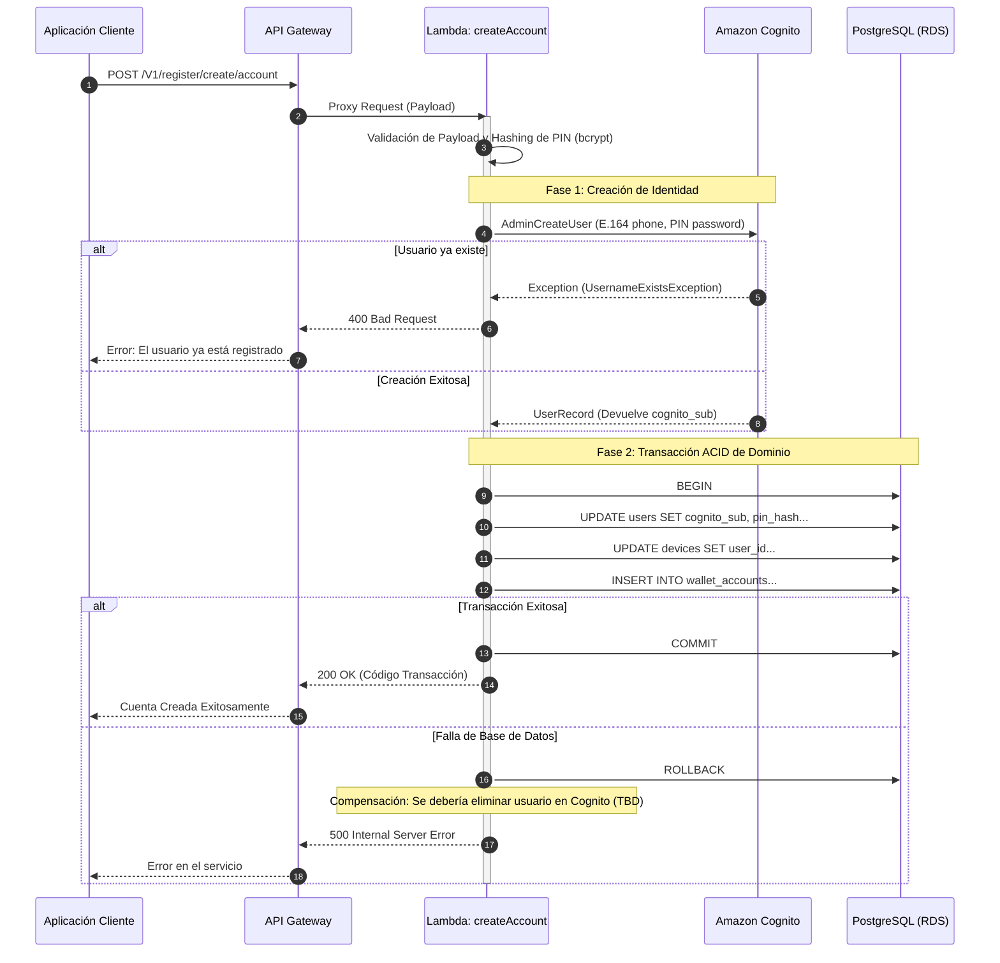
```mermaid
sequenceDiagram
    autonumber
    participant Client as Aplicación Cliente
    participant APIGW as API Gateway
    participant Lambda as Lambda: createAccount
    participant Cognito as Amazon Cognito
    participant RDS as PostgreSQL (RDS)
    
    Client->>APIGW: POST /V1/register/create/account
    APIGW->>Lambda: Proxy Request (Payload)
    
    activate Lambda
    Lambda->>Lambda: Validación de Payload y Hashing de PIN (bcrypt)
    
    note over Lambda,Cognito: Fase 1: Creación de Identidad
    Lambda->>Cognito: AdminCreateUser (E.164 phone, PIN password)
    
    alt Usuario ya existe
        Cognito-->>Lambda: Exception (UsernameExistsException)
        Lambda-->>APIGW: 400 Bad Request
        APIGW-->>Client: Error: El usuario ya está registrado
    else Creación Exitosa
        Cognito-->>Lambda: UserRecord (Devuelve cognito_sub)
    end
    
    note over Lambda,RDS: Fase 2: Transacción ACID de Dominio
    Lambda->>RDS: BEGIN
    Lambda->>RDS: UPDATE users SET cognito_sub, pin_hash...
    Lambda->>RDS: UPDATE devices SET user_id...
    Lambda->>RDS: INSERT INTO wallet_accounts...
    
    alt Transacción Exitosa
        Lambda->>RDS: COMMIT
        Lambda-->>APIGW: 200 OK (Código Transacción)
        APIGW-->>Client: Cuenta Creada Exitosamente
    else Falla de Base de Datos
        Lambda->>RDS: ROLLBACK
        note over Lambda: Compensación: Se debería eliminar usuario en Cognito (TBD)
        Lambda-->>APIGW: 500 Internal Server Error
        APIGW-->>Client: Error en el servicio
    end
    deactivate Lambda
```

### 4.2. Flujo de Autenticación Híbrida (Login)
El sistema valida al usuario, gestiona el estado de sesión y devuelve credenciales temporales o tokens.

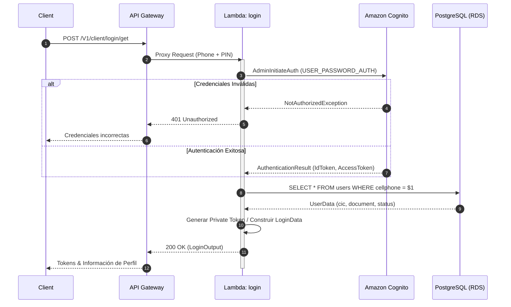
```mermaid
sequenceDiagram
    autonumber
    participant Client
    participant APIGW as API Gateway
    participant Lambda as Lambda: login
    participant Cognito as Amazon Cognito
    participant RDS as PostgreSQL (RDS)
    
    Client->>APIGW: POST /V1/client/login/get
    APIGW->>Lambda: Proxy Request (Phone + PIN)
    
    activate Lambda
    Lambda->>Cognito: AdminInitiateAuth (USER_PASSWORD_AUTH)
    
    alt Credenciales Inválidas
        Cognito-->>Lambda: NotAuthorizedException
        Lambda-->>APIGW: 401 Unauthorized
        APIGW-->>Client: Credenciales incorrectas
    else Autenticación Exitosa
        Cognito-->>Lambda: AuthenticationResult (IdToken, AccessToken)
    end
    
    Lambda->>RDS: SELECT * FROM users WHERE cellphone = $1
    RDS-->>Lambda: UserData (cic, document, status)
    
    Lambda->>Lambda: Generar Private Token / Construir LoginData
    
    Lambda-->>APIGW: 200 OK (LoginOutput)
    APIGW-->>Client: Tokens & Información de Perfil
    deactivate Lambda
```

---

## 5. Prácticas de Ingeniería y Optimización

### Rendimiento (Performance)
1. **Gestión de Conexiones a BD:** Se implementa un singleton de validación de pooler de PostgreSQL (`pg.Pool`). Las instancias Lambda "Warm" reutilizan conexiones para reducir drásticamente el tiempo de respuesta (Cold Start mitigation).
2. **Bundling Agresivo:** Se utiliza `esbuild` para compilar el código TypeScript. Esto reduce el tamaño de los artefactos de megabytes a pocos kilobytes, acelerando los tiempos de cold-start de los Lambdas.

### Seguridad Avanzada
1. **Gestión de Secretos:** Las credenciales de la base de datos se generan dinámicamente y se almacenan en **AWS Secrets Manager**. El stack de base de datos de CDK propaga el Secret ARN al stack de la API. Los Lambdas obtienen las credenciales en tiempo de ejecución.
2. **Roles de Ejecución (Least Privilege):** Cada Lambda recibe permisos estrictos y limitados (ej. `cognito-idp:AdminCreateUser` y acceso de lectura estricto al ARN específico en Secrets Manager).

### 6. Definición de Contratos y API (AWS Smithy)

Se ha utilizado **AWS Smithy** (`backend/smithy/main.smithy`) como la fuente de la verdad para el modelado puramente agnóstico de las APIs. Esto garantiza estructuras inmutables, reutilizables, tipado fuerte y una definición de errores centralizada bajo el protocolo `aws.protocols#restJson1`.

#### Diagrama de Componentes de la Capa de API

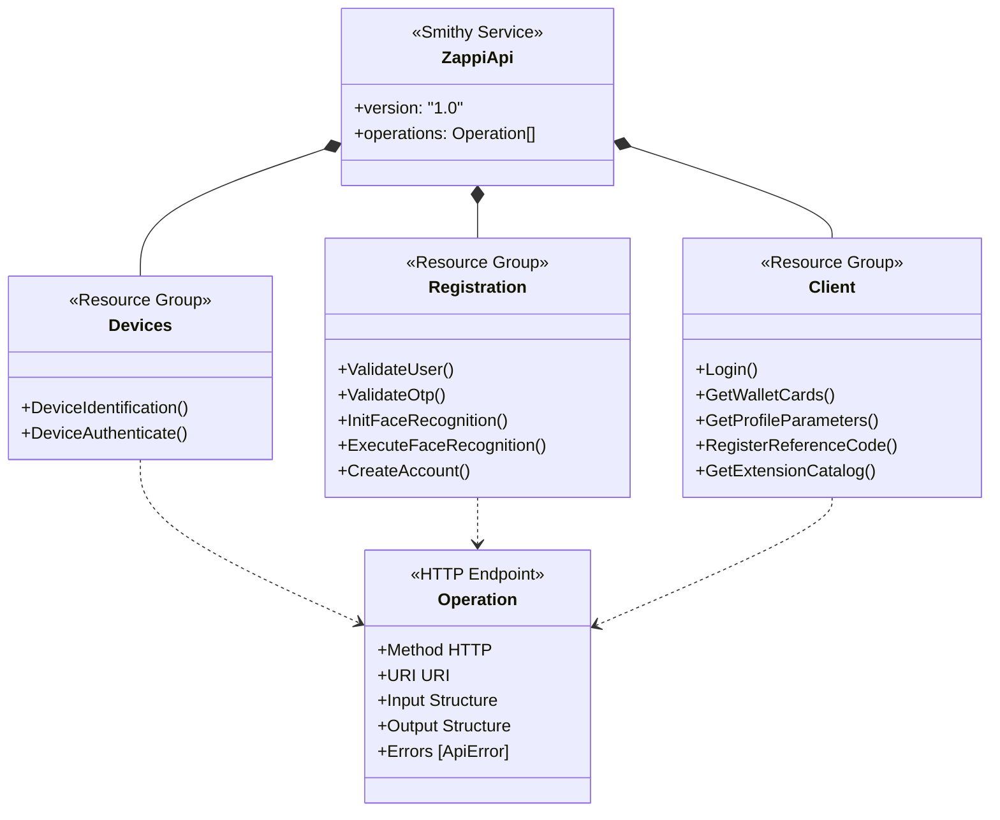
```mermaid
classDiagram
    class ZappiApi {
        <<Smithy Service>>
        +version: "1.0"
        +operations: Operation[]
    }

    class Operation {
        <<HTTP Endpoint>>
        +Method HTTP
        +URI URI
        +Input Structure
        +Output Structure
        +Errors [ApiError]
    }

    class Devices {
        <<Resource Group>>
        +DeviceIdentification()
        +DeviceAuthenticate()
    }

    class Registration {
        <<Resource Group>>
        +ValidateUser()
        +ValidateOtp()
        +InitFaceRecognition()
        +ExecuteFaceRecognition()
        +CreateAccount()
    }

    class Client {
        <<Resource Group>>
        +Login()
        +GetWalletCards()
        +GetProfileParameters()
        +RegisterReferenceCode()
        +GetExtensionCatalog()
    }

    ZappiApi *-- Devices
    ZappiApi *-- Registration
    ZappiApi *-- Client
    Devices ..> Operation
    Registration ..> Operation
    Client ..> Operation
```

#### Especificación Técnica de Endpoints

El servicio define 13 operaciones clave, cada una mapeada directamente a una función Lambda independiente:

| Dominio | Endpoint | Verbo | Propósito Principal | Contexto / Capa |
| :--- | :--- | :--- | :--- | :--- |
| **Dispositivos** | `/V1/device/identification` | `POST` | Identificar y registrar hardware. Retorna llaves de cifrado simuladas y genera ID de dispositivo. | Bootstrapping |
| **Dispositivos** | `/V1/device/authenticate` | `POST` | Autenticar un dispositivo previamente registrado y verificar trust. | Device Trust |
| **Registro** | `/V1/register/validate/user` | `POST` | Validar documento de identidad y verificar pre-existencia del usuario en RDS y AS/400. | Onboarding |
| **Registro** | `/V1/register/validate/otp` | `POST` | Validar el código de seguridad (OTP) enviado por SMS/Email para confirmar posesión de línea. | Onboarding |
| **Biometría** | `/V1/register/init/face/recognition` | `POST` | Inicializar sesión biométrica (liveness testing). Crea sesión temporal en RDS. | Identity Auth |
| **Biometría** | `/V1/register/execute/face/recognition`| `POST` | Validar el payload de la biometría (Selfie), firmar el estado y enlazar con el documento. | Identity Auth |
| **Registro** | `/V1/register/create/account` | `POST` | **Endpoint Crítico**: Registra en Cognito, asocia información final en RDS, y provisiona una cuenta en Wallet. | Transaccional |
| **Cliente** | `/V1/client/login/get` | `POST` | Inicia sesión usando Auth Flow (`USER_PASSWORD_AUTH`) contra AWS Cognito y devuelve perfiles cruzados RDS. | Authentication |
| **Catálogos** | `/V1/client/device/register/extension/get` | `POST` | Obtiene el catálogo inmutable de extensiones documentales por región. | Metadata |
| **Perfil** | `/V1/profile/parameters/get` | `POST` | Retorna los parámetros de configuración de UI y mensajes de bienvenida basados en segmentos. | Presentation |
| **Wallet** | `/V1/client/walletcards/information/get`| `POST` | Devuelve el balance (Core Bancario), movimientos de tarjeta y el PAN enmascarado. | Financial Core |
| **Referidos**| `/V1/client/reference/register/code` | `POST` | Registra y valida matemáticamente el código promocional de referidos. | Growth |
| **Referidos**| `/V1/client/reference/welcome` | `POST` | Confirma validez de referidos una vez completado el flujo. | Growth |

#### Diagramas de Secuencia de Operaciones Específicas

##### A. Flujo de Identificación de Dispositivos (`DeviceIdentification`)
El primer paso en la cadena de confianza para vincular hardware (Mobile/Device) con nuestra base de datos, vital para prevención de fraudes y fingerprinting.

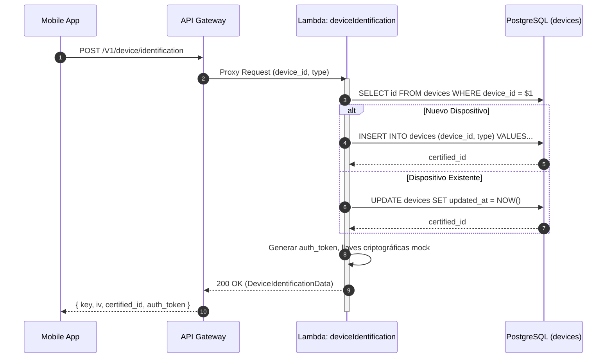
```mermaid
sequenceDiagram
    autonumber
    participant App as Mobile App
    participant APIGW as API Gateway
    participant Lambda as Lambda: deviceIdentification
    participant RDS as PostgreSQL (devices)

    App->>APIGW: POST /V1/device/identification
    APIGW->>Lambda: Proxy Request (device_id, type)
    
    activate Lambda
    Lambda->>RDS: SELECT id FROM devices WHERE device_id = $1
    alt Nuevo Dispositivo
        Lambda->>RDS: INSERT INTO devices (device_id, type) VALUES...
        RDS-->>Lambda: certified_id
    else Dispositivo Existente
        Lambda->>RDS: UPDATE devices SET updated_at = NOW()
        RDS-->>Lambda: certified_id
    end
    
    Lambda->>Lambda: Generar auth_token, llaves criptográficas mock
    Lambda-->>APIGW: 200 OK (DeviceIdentificationData)
    APIGW-->>App: { key, iv, certified_id, auth_token }
    deactivate Lambda
```

##### B. Flujo de Reconocimiento Facial (Validación Biométrica en 2 Pasos)
Proceso asíncrono para garantizar pruebas de Liveness sin bloquear los tiempos de procesamiento en cliente.

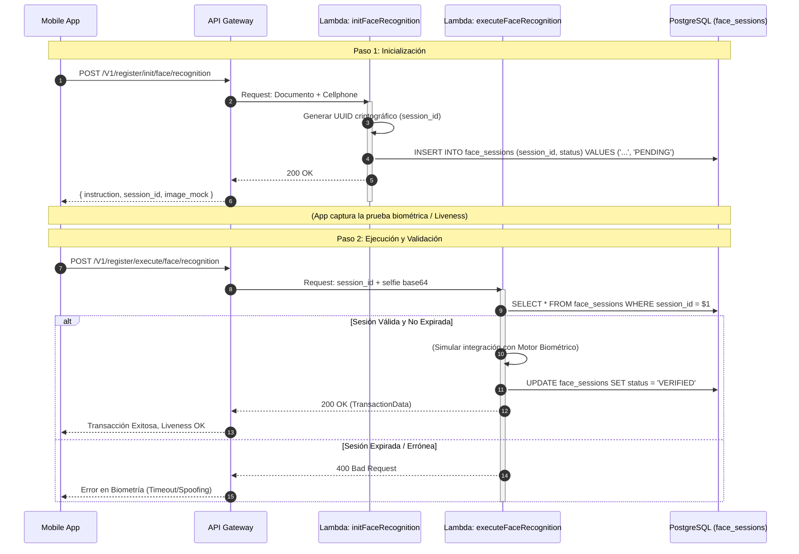
```mermaid
sequenceDiagram
    autonumber
    participant App as Mobile App
    participant APIGW as API Gateway
    participant LambdaInit as Lambda: initFaceRecognition
    participant LambdaExec as Lambda: executeFaceRecognition
    participant RDS as PostgreSQL (face_sessions)

    Note over App,RDS: Paso 1: Inicialización
    App->>APIGW: POST /V1/register/init/face/recognition
    APIGW->>LambdaInit: Request: Documento + Cellphone
    
    activate LambdaInit
    LambdaInit->>LambdaInit: Generar UUID criptográfico (session_id)
    LambdaInit->>RDS: INSERT INTO face_sessions (session_id, status) VALUES ('...', 'PENDING')
    LambdaInit-->>APIGW: 200 OK
    APIGW-->>App: { instruction, session_id, image_mock }
    deactivate LambdaInit
    
    Note over App,RDS: (App captura la prueba biométrica / Liveness)
    
    Note over App,RDS: Paso 2: Ejecución y Validación
    App->>APIGW: POST /V1/register/execute/face/recognition
    APIGW->>LambdaExec: Request: session_id + selfie base64
    
    activate LambdaExec
    LambdaExec->>RDS: SELECT * FROM face_sessions WHERE session_id = $1
    alt Sesión Válida y No Expirada
        LambdaExec->>LambdaExec: (Simular integración con Motor Biométrico)
        LambdaExec->>RDS: UPDATE face_sessions SET status = 'VERIFIED'
        LambdaExec-->>APIGW: 200 OK (TransactionData)
        APIGW-->>App: Transacción Exitosa, Liveness OK
    else Sesión Expirada / Errónea
        LambdaExec-->>APIGW: 400 Bad Request
        APIGW-->>App: Error en Biometría (Timeout/Spoofing)
    end
    deactivate LambdaExec
```

---

##### C. Flujo de Autenticación de Dispositivos (`DeviceAuthenticate`)
Verifica un dispositivo que ya ha pasado por la fase de `Identification` en inicios de sesión subsecuentes.

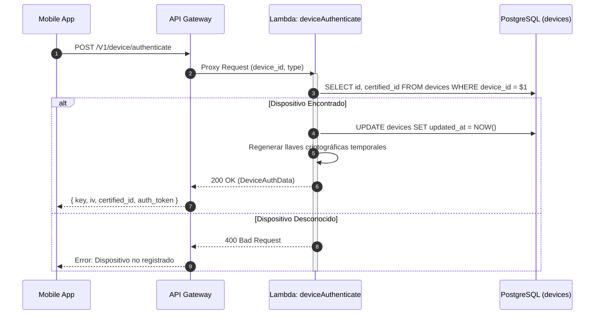
```mermaid
sequenceDiagram
    autonumber
    participant App as Mobile App
    participant APIGW as API Gateway
    participant Lambda as Lambda: deviceAuthenticate
    participant RDS as PostgreSQL (devices)

    App->>APIGW: POST /V1/device/authenticate
    APIGW->>Lambda: Proxy Request (device_id, type)
    
    activate Lambda
    Lambda->>RDS: SELECT id, certified_id FROM devices WHERE device_id = $1
    alt Dispositivo Encontrado
        Lambda->>RDS: UPDATE devices SET updated_at = NOW()
        Lambda->>Lambda: Regenerar llaves criptográficas temporales
        Lambda-->>APIGW: 200 OK (DeviceAuthData)
        APIGW-->>App: { key, iv, certified_id, auth_token }
    else Dispositivo Desconocido
        Lambda-->>APIGW: 400 Bad Request
        APIGW-->>App: Error: Dispositivo no registrado
    end
    deactivate Lambda
```

##### D. Flujo de Validación Onboarding (`ValidateUser` & `ValidateOtp`)
Fase temprana de onboarding donde se consultan listas grises/negras, persistencia parcial y confirmación SMS (OTP).

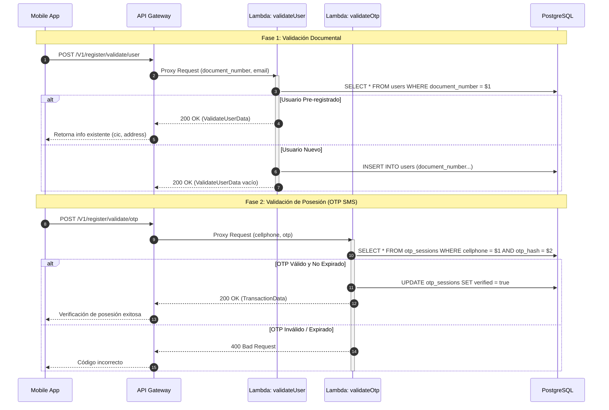
```mermaid
sequenceDiagram
    autonumber
    participant App as Mobile App
    participant APIGW as API Gateway
    participant LUser as Lambda: validateUser
    participant LOtp as Lambda: validateOtp
    participant RDS as PostgreSQL

    Note over App,RDS: Fase 1: Validación Documental
    App->>APIGW: POST /V1/register/validate/user
    APIGW->>LUser: Proxy Request (document_number, email)
    activate LUser
    LUser->>RDS: SELECT * FROM users WHERE document_number = $1
    alt Usuario Pre-registrado
        LUser-->>APIGW: 200 OK (ValidateUserData)
        APIGW-->>App: Retorna info existente (cic, address)
    else Usuario Nuevo
        LUser->>RDS: INSERT INTO users (document_number...)
        LUser-->>APIGW: 200 OK (ValidateUserData vacío)
    end
    deactivate LUser

    Note over App,RDS: Fase 2: Validación de Posesión (OTP SMS)
    App->>APIGW: POST /V1/register/validate/otp
    APIGW->>LOtp: Proxy Request (cellphone, otp)
    activate LOtp
    LOtp->>RDS: SELECT * FROM otp_sessions WHERE cellphone = $1 AND otp_hash = $2
    alt OTP Válido y No Expirado
        LOtp->>RDS: UPDATE otp_sessions SET verified = true
        LOtp-->>APIGW: 200 OK (TransactionData)
        APIGW-->>App: Verificación de posesión exitosa
    else OTP Inválido / Expirado
        LOtp-->>APIGW: 400 Bad Request
        APIGW-->>App: Código incorrecto
    end
    deactivate LOtp
```

##### E. Flujo de Consulta Financiera (`GetWalletCards`)
Obtiene información consolidada de los balances financieros y últimas transacciones en el Home del App.

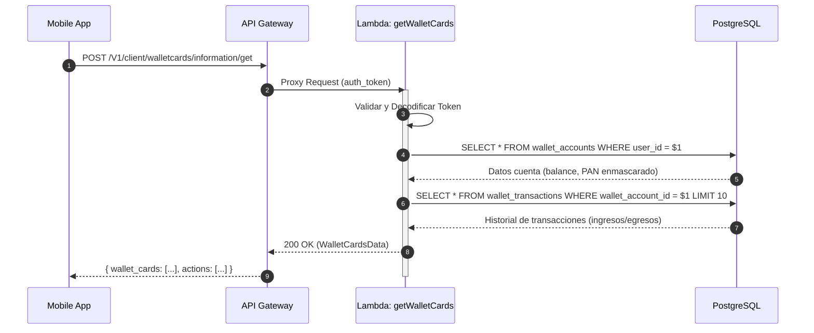
```mermaid
sequenceDiagram
    autonumber
    participant App as Mobile App
    participant APIGW as API Gateway
    participant Lambda as Lambda: getWalletCards
    participant RDS as PostgreSQL

    App->>APIGW: POST /V1/client/walletcards/information/get
    APIGW->>Lambda: Proxy Request (auth_token)
    
    activate Lambda
    Lambda->>Lambda: Validar y Decodificar Token
    Lambda->>RDS: SELECT * FROM wallet_accounts WHERE user_id = $1
    RDS-->>Lambda: Datos cuenta (balance, PAN enmascarado)
    Lambda->>RDS: SELECT * FROM wallet_transactions WHERE wallet_account_id = $1 LIMIT 10
    RDS-->>Lambda: Historial de transacciones (ingresos/egresos)
    
    Lambda-->>APIGW: 200 OK (WalletCardsData)
    APIGW-->>App: { wallet_cards: [...], actions: [...] }
    deactivate Lambda
```

##### F. Metadatos, Catálogos y Parámetros (`GetExtensionCatalog` & `GetProfileParameters`)
Endpoints estáticos optimizados (potencial uso de caché distribuido futuro) para configuración de la UI.

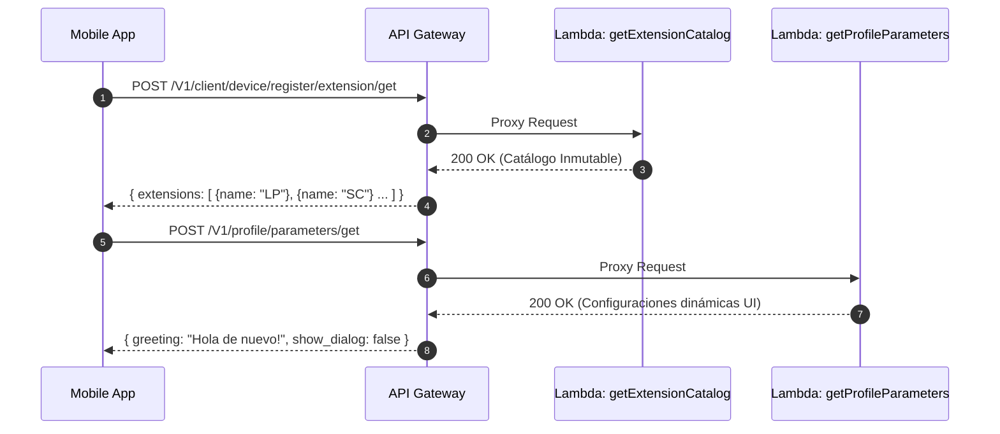
```mermaid
sequenceDiagram
    autonumber
    participant App as Mobile App
    participant APIGW as API Gateway
    participant LCat as Lambda: getExtensionCatalog
    participant LProf as Lambda: getProfileParameters

    App->>APIGW: POST /V1/client/device/register/extension/get
    APIGW->>LCat: Proxy Request
    LCat-->>APIGW: 200 OK (Catálogo Inmutable)
    APIGW-->>App: { extensions: [ {name: "LP"}, {name: "SC"} ... ] }

    App->>APIGW: POST /V1/profile/parameters/get
    APIGW->>LProf: Proxy Request
    LProf-->>APIGW: 200 OK (Configuraciones dinámicas UI)
    APIGW-->>App: { greeting: "Hola de nuevo!", show_dialog: false }
```

##### G. Flujo de Captación (Referidos: `RegisterReferenceCode` & `WelcomeReference`)
Programa de afiliación y recompensa por onboarding exitoso con código promocional.

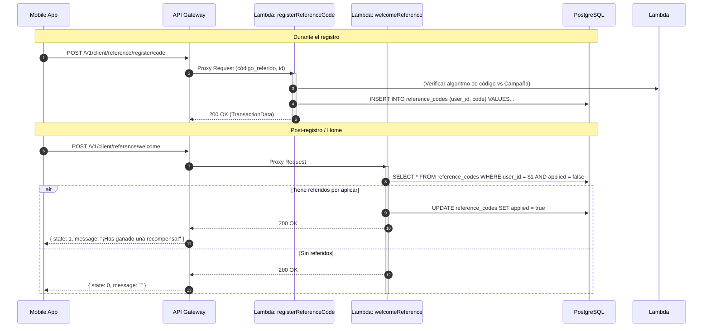
```mermaid
sequenceDiagram
    autonumber
    participant App as Mobile App
    participant APIGW as API Gateway
    participant LReg as Lambda: registerReferenceCode
    participant LWel as Lambda: welcomeReference
    participant RDS as PostgreSQL

    Note over App,RDS: Durante el registro
    App->>APIGW: POST /V1/client/reference/register/code
    APIGW->>LReg: Proxy Request (código_referido, id)
    activate LReg
    LReg->>Lambda: (Verificar algoritmo de código vs Campaña)
    LReg->>RDS: INSERT INTO reference_codes (user_id, code) VALUES...
    LReg-->>APIGW: 200 OK (TransactionData)
    deactivate LReg

    Note over App,RDS: Post-registro / Home
    App->>APIGW: POST /V1/client/reference/welcome
    APIGW->>LWel: Proxy Request
    activate LWel
    LWel->>RDS: SELECT * FROM reference_codes WHERE user_id = $1 AND applied = false
    alt Tiene referidos por aplicar
        LWel->>RDS: UPDATE reference_codes SET applied = true
        LWel-->>APIGW: 200 OK
        APIGW-->>App: { state: 1, message: "¡Has ganado una recompensa!" }
    else Sin referidos
        LWel-->>APIGW: 200 OK
        APIGW-->>App: { state: 0, message: "" }
    end
    deactivate LWel
```

---

> **Nota del Arquitecto:** Este repositorio consolida la infraestructura como código junto con la lógica de negocio, creando una cápsula autónoma (Monorepo). La separación por capas facilita escalar el modelo a arquitecturas de microservicios o integraciones con sistemas core bancarios en el futuro sin reestructurar los contratos definidos en Smithy.

---

## 7. Arquitectura de Modelado API (AWS Smithy)

El proyecto utiliza una canalización automatizada para convertir modelos abstractos de dominio en documentación y contratos estrictos (Generation Architecture).

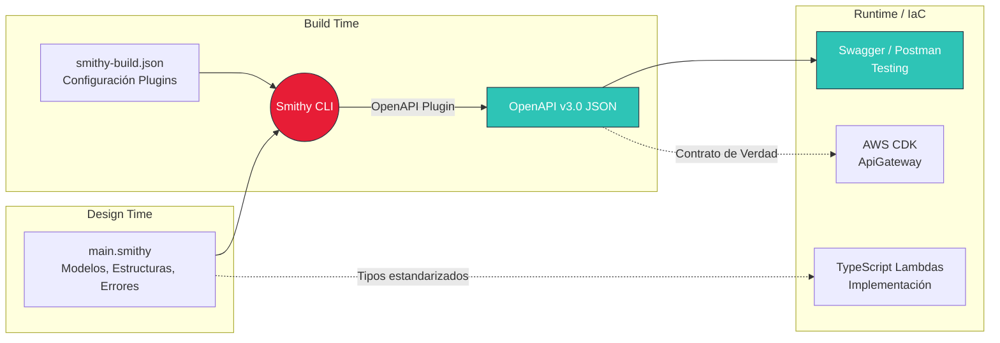
```mermaid
graph LR
    subgraph Diseño [Design Time]
        A[main.smithy<br>Modelos, Estructuras, Errores]
    end
    
    subgraph Compilación [Build Time]
        B((Smithy CLI))
        C[smithy-build.json<br>Configuración Plugins]
        
        A --> B
        C --> B
        B -->|OpenAPI Plugin| D[OpenAPI v3.0 JSON]
    end
    
    subgraph Desarrollo [Runtime / IaC]
        E[Swagger / Postman<br>Testing]
        F[AWS CDK<br>ApiGateway]
        G[TypeScript Lambdas<br>Implementación]
        
        D --> E
        D -.->|Contrato de Verdad| F
        A -.->|Tipos estandarizados| G
    end
    
    classDef tool fill:#E71D36,stroke:#232F3E,color:white;
    classDef output fill:#2EC4B6,stroke:#232F3E,color:white;
    class B tool;
    class D,E output;
```

---

## 8. Gestión del Proyecto: Product Backlog y Sprints

El desarrollo de la arquitectura y el backend se ejecutó mediante un marco de trabajo ágil. A continuación, se presenta el backlog retrospectivo del proyecto agrupado en historias de usuario y organizado en Sprints de implementación para llegar a su estado actual.

### Product Backlog (Épicas)
* **EP-01:** Infraestructura como Código (VPC, RDS, APIGW).
* **EP-02:** Gestión de Identidades y Dispositivos (Cognito, Device Trust).
* **EP-03:** Onboarding Financiero (Validación, Biometría, Creación).
* **EP-04:** Operaciones de Cliente (Login, Wallet, Referidos).

### Planificación de Sprints

#### Sprint 1: Fundación Arquitectónica y Contratos
**Objetivo:** Establecer el monorepo, los modelos agnósticos y la infraestructura de red y datos.
* **HU-1.1:** *Como Arquitecto, quiero definir el contrato de la API en AWS Smithy para estandarizar payloads y errores.*
  * Tarea 1: Instalar y configurar dependencias de AWS Smithy en `smithy-build.json`.
  * Tarea 2: Modelar los 13 endpoints usando el protocolo `restJson1`.
* **HU-1.2:** *Como DevOps, quiero crear un proyecto CDK con VPC y Base de datos RDS PostgreSQL.*
  * Tarea 1: Inicializar el App de CDK y crear `DatabaseStack` con VPC privada aislada.
  * Tarea 2: Configurar el esquema relacional DDL (`schema.sql`) de tablas transaccionales.
  * Tarea 3: Integrar `SecretsManager` para contraseñas rotativas del RDS.

#### Sprint 2: Seguridad y Componentes Base
**Objetivo:** Desplegar IAM, Amazon Cognito y la arquitectura base de integración.
* **HU-2.1:** *Como DevSecOps, quiero provisionar Amazon Cognito para gestionar el ciclo de vida de usuarios.*
  * Tarea 1: Programar `AuthStack` definiendo User Pools con alias en número de teléfono.
  * Tarea 2: Implementar atributos personalizados de Cognito (CIC, Documento de Identidad).
* **HU-2.2:** *Como Backend Developer, quiero crear una capa de conexión reutilizable a PostgreSQL.*
  * Tarea 1: Programar abstracción singleton de `pg.Pool` con manejo de latencia en "warm-starts".
  * Tarea 2: Consumir credenciales seguras vía `SecretsManagerClient` de AWS SDK v3.

#### Sprint 3: Flujo Crítico de Onboarding
**Objetivo:** Implementar los handlers Lambda necesarios para registrar un usuario de extremo a extremo.
* **HU-3.1:** *Como Usuario Nuevo, quiero validar mi documento y teléfono (OTP) para continuar mi registro.*
  * Tarea 1: Desarrollar Lambda `validateUser` consultando usuarios pre-existentes en la Base de Datos.
  * Tarea 2: Codificar el manejador lógico para `validateOtp`.
* **HU-3.2:** *Como Usuario Validado, quiero que mi cuenta financiera y digital sea creada.*
  * Tarea 1: Desarrollar handler Lambda `createAccount`.
  * Tarea 2: Coordinar transacción distribuida: Insertar Identidad en Cognito + Insertar ACID en tablas `users`, `devices` y `wallet_accounts` en RDS.

#### Sprint 4: Biometría y Dispositivos de Confianza
**Objetivo:** Implementar la prueba biométrica (Liveness) y asociar seguridad de hardware.
* **HU-4.1:** *Como Sistema de Seguridad, quiero asegurar que el dispositivo sea registrado y confiable.*
  * Tarea 1: Programar endpoint `deviceIdentification` para generar un ID criptográfico.
  * Tarea 2: Construir flujo `deviceAuthenticate` para re-ingresos con hardware conocido.
* **HU-4.2:** *Como Oficial de Fraude, quiero que el usuario apruebe validación facial antes de entrar al sistema.*
  * Tarea 1: Programar Lambda `initFaceRecognition` registrando la sesión temporal en BD.
  * Tarea 2: Desarrollar `executeFaceRecognition` para recibir el token base64 y cambiar el estatus a "VERIFIED".

#### Sprint 5: Módulo de Cliente y Fidelización
**Objetivo:** Dar soporte al inicio de sesión, visualización del balance financiero y campañas.
* **HU-5.1:** *Como Cliente Registrado, quiero iniciar sesión en mi aplicación para consultar mi balance (Wallet).*
  * Tarea 1: Programar la validación `login` ejecutando el flujo `USER_PASSWORD_AUTH` contra AWS Cognito.
  * Tarea 2: Programar Lambda `getWalletCards` para cruzar movimientos y saldo en PostgreSQL.
* **HU-5.2:** *Como Equipo de Growth, quiero habilitar recompensas por referidos.*
  * Tarea 1: Programar endpoints `registerReferenceCode` y `welcomeReference`.
  * Tarea 2: Diseñar y codificar `getProfileParameters` para el dinamismo de la UI.

---

## 9. Estrategia y Ejecución de Pruebas (Quality Assurance)

El proyecto cuenta con un enfoque pragmático orientado a **Pruebas de Integración End-to-End (E2E)** ejecutadas directamente contra los entornos desplegados en AWS. Esto garantiza que la configuración de API Gateway, los permisos IAM de las Lambdas, la validación en Cognito y las transacciones en RDS funcionen como un ecosistema cohesionado.

### Automatización de Pruebas (Scripts)
Para la validación continua y prevención de regresiones, se construyeron rutinas automatizadas en PowerShell ubicadas en la raíz del proyecto:
* `test-endpoints.ps1`: Simula el flujo completo de Onboarding, mock de biometría y aprovisionamiento de cuenta de extremo a extremo.
* `test-login.ps1` / `test-login2.ps1`: Valida los flujos de autenticación recurrente, intercepción de tokens y manejo de errores con Cognito.

### Casos de Prueba Críticos (Test Cases)

A continuación, se documentan los Casos de Prueba (TC) principales que rigieron la certificación del backend:

| ID | Caso de Prueba | Precondiciones | Pasos de Ejecución | Resultado Esperado | Estado |
|:---|:---|:---|:---|:---|:---|
| **TC-01** | **Identificación de Nuevo Dispositivo** | Ninguna. | 1. Hacer POST a `/V1/device/identification` con un UUID de hardware simulado. 2. Validar respuesta HTTP. | Código 200. Retorna `certified_id`, `auth_token` e inserta fila en RDS `devices`. | ✅ Pasó |
| **TC-02** | **Validación de Identidad (Onboarding)** | El documento no debe existir en RDS. | 1. POST a `/V1/register/validate/user` enviando DNI y email. | Código 200. El payload `data` debe retornar vacío indicando que es libre para registro. | ✅ Pasó |
| **TC-03** | **Validación de Identidad (Rechazo)** | El documento YA existe en RDS. | 1. POST a `/V1/register/validate/user` enviando DNI existente. | Código 200. Retorna la información enmascarada para prevenir duplicación. | ✅ Pasó |
| **TC-04** | **Inicialización Biométrica** | Documento válido enviado. | 1. POST a `/V1/register/init/face/recognition`. 2. Extraer `session_id`. | Código 200. Se crea sesión temporal en `face_sessions` con status `PENDING`. | ✅ Pasó |
| **TC-05** | **Creación y Transaccionalidad de Cuenta** | Pines generados, OTP validado. | 1. POST a `/V1/register/create/account` con PIN, celular y datos. 2. Verificar Amazon Cognito. 3. Verificar RDS. | Código 200. Usuario es creado en Cognito. Las tablas `users`, `devices` y `wallet_accounts` se enlazan atómicamente. | ✅ Pasó |
| **TC-06** | **Autenticación (Login Exitoso)** | Cuenta creada en TC-05. | 1. POST a `/V1/client/login/get` con celular (Alias) y PIN. 2. Interceptar tokens JWT. | Código 200. Devuelve el JWT encapsulado en `private_token` e información del Perfil RDS. | ✅ Pasó |
| **TC-07** | **Prevención de Login Inválido** | Cuenta existente. | 1. POST a `login/get` con PIN erróneo repetidamente. | Cognito detecta falla (NotAuthorizedException), API Gateway retorna 401/400. | ✅ Pasó |
| **TC-08** | **Consulta de Wallet y Movimientos** | Autenticado (Token válido). | 1. POST a `/V1/client/walletcards/information/get`. | Retorna balance numérico, número de cuenta virtual y lista de transacciones. | ✅ Pasó |

> **Evaluación QA:** Las pruebas demuestran que las políticas de consistencia eventual (Cognito) y consistencia fuerte (ACID en RDS) coexisten sin generar estados huérfanos. Las barreras de autorización protegen exitosamente las rutas privadas.

### Arquitectura y Flujos de Automatización de Pruebas

Para garantizar que los flujos se prueban en un entorno idéntico al de producción, la arquitectura de pruebas ejecuta rutinas (PowerShell) desde el entorno local contra el API Gateway remoto, inyectando mocks de información en cada invocación.

#### Diagrama de Arquitectura de Testing

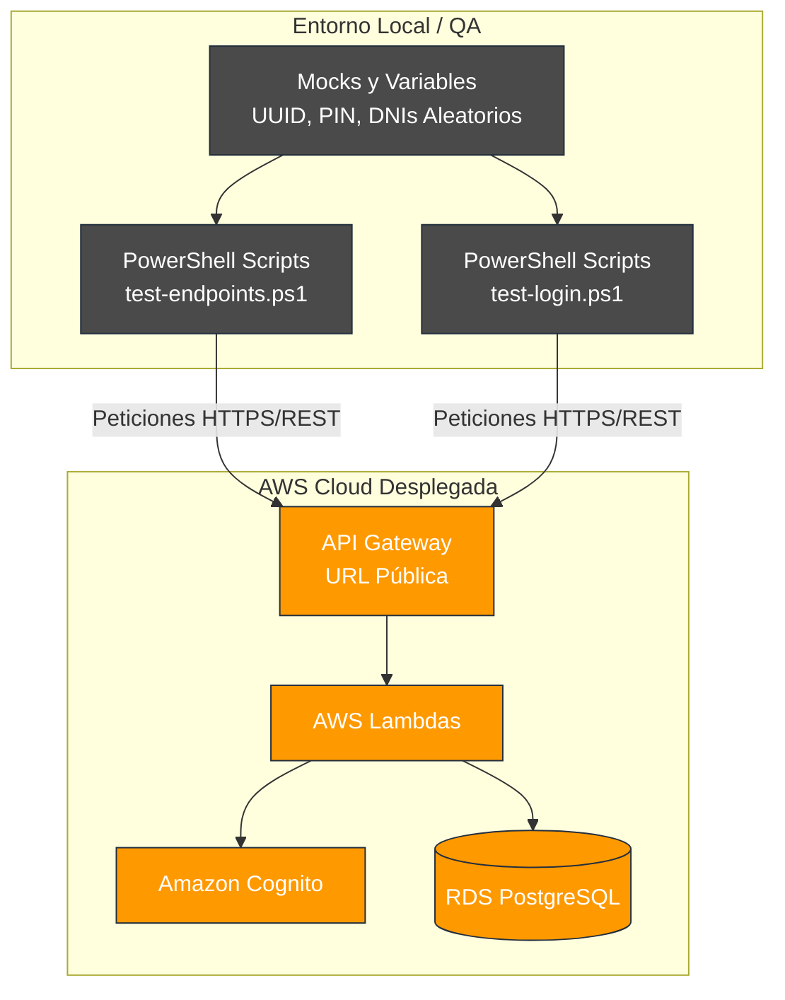
```mermaid
graph TD
    subgraph Testing Automation [Entorno Local / QA]
        PS1[PowerShell Scripts<br>test-endpoints.ps1]
        PS2[PowerShell Scripts<br>test-login.ps1]
        Mock[Mocks y Variables<br>UUID, PIN, DNIs Aleatorios]
    end

    subgraph AWS Target Environment [AWS Cloud Desplegada]
        APIGW[API Gateway<br>URL Pública]
        Cognito[Amazon Cognito]
        RDS[(RDS PostgreSQL)]
        Lambdas[AWS Lambdas]
    end

    PS1 -- Peticiones HTTPS/REST --> APIGW
    PS2 -- Peticiones HTTPS/REST --> APIGW
    
    Mock --> PS1
    Mock --> PS2

    APIGW --> Lambdas
    Lambdas --> Cognito
    Lambdas --> RDS
    
    classDef test fill:#4A4A4A,stroke:#232F3E,color:white;
    classDef aws fill:#FF9900,stroke:#232F3E,color:white;
    class PS1,PS2,Mock test;
    class APIGW,Cognito,RDS,Lambdas aws;
```

#### Diagrama de Secuencia: Flujo E2E de Onboarding (`test-endpoints.ps1`)
Este script orquesta una prueba de integración (Integration Testing) encadenando múltiples llamados, asegurando que el estado generado por un endpoint es correctamente consumido por el siguiente.

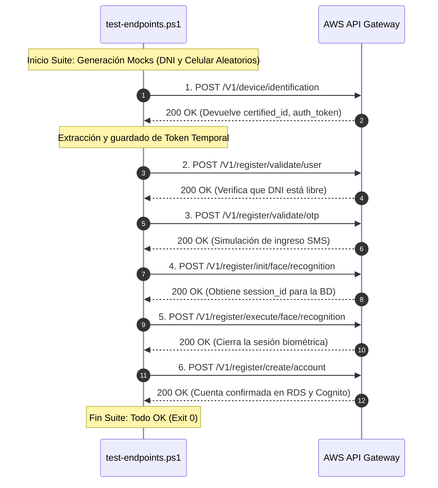
```mermaid
sequenceDiagram
    autonumber
    participant Script as test-endpoints.ps1
    participant APIGW as AWS API Gateway
    
    Note over Script: Inicio Suite: Generación Mocks (DNI y Celular Aleatorios)
    
    Script->>APIGW: 1. POST /V1/device/identification
    APIGW-->>Script: 200 OK (Devuelve certified_id, auth_token)
    Note over Script: Extracción y guardado de Token Temporal
    
    Script->>APIGW: 2. POST /V1/register/validate/user
    APIGW-->>Script: 200 OK (Verifica que DNI está libre)
    
    Script->>APIGW: 3. POST /V1/register/validate/otp
    APIGW-->>Script: 200 OK (Simulación de ingreso SMS)
    
    Script->>APIGW: 4. POST /V1/register/init/face/recognition
    APIGW-->>Script: 200 OK (Obtiene session_id para la BD)
    
    Script->>APIGW: 5. POST /V1/register/execute/face/recognition
    APIGW-->>Script: 200 OK (Cierra la sesión biométrica)
    
    Script->>APIGW: 6. POST /V1/register/create/account
    APIGW-->>Script: 200 OK (Cuenta confirmada en RDS y Cognito)
    
    Note over Script: Fin Suite: Todo OK (Exit 0)
```

#### Diagrama de Secuencia: Flujo E2E de Autenticación (`test-login.ps1`)
Este script se enfoca en las pruebas de autenticación repetitiva, validando el correcto intercambio de credenciales por Tokens JWT reales emitidos por AWS Cognito y el perfil de RDS.

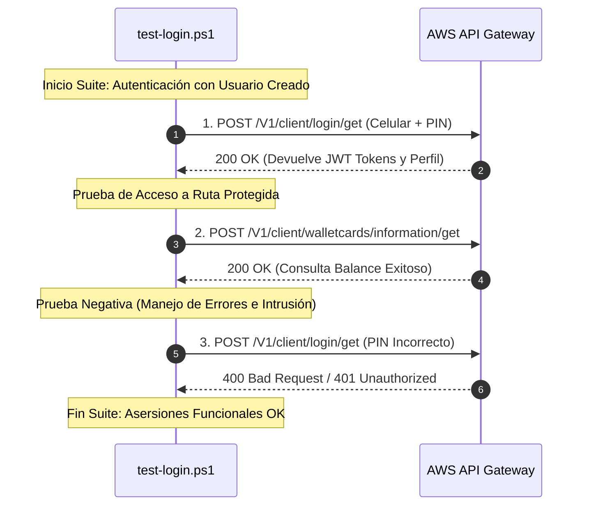
```mermaid
sequenceDiagram
    autonumber
    participant Script as test-login.ps1
    participant APIGW as AWS API Gateway
    
    Note over Script: Inicio Suite: Autenticación con Usuario Creado
    
    Script->>APIGW: 1. POST /V1/client/login/get (Celular + PIN)
    APIGW-->>Script: 200 OK (Devuelve JWT Tokens y Perfil)
    
    Note over Script: Prueba de Acceso a Ruta Protegida
    Script->>APIGW: 2. POST /V1/client/walletcards/information/get
    APIGW-->>Script: 200 OK (Consulta Balance Exitoso)
    
    Note over Script: Prueba Negativa (Manejo de Errores e Intrusión)
    Script->>APIGW: 3. POST /V1/client/login/get (PIN Incorrecto)
    APIGW-->>Script: 400 Bad Request / 401 Unauthorized
    
    Note over Script: Fin Suite: Asersiones Funcionales OK
```
